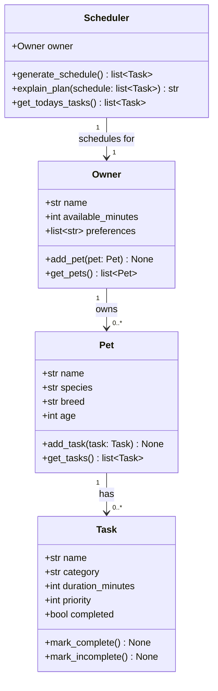

# PawPal+ Project Reflection

## 1. System Design

### Core User Actions

Three core actions a user should be able to perform:

1. **Add a pet** — Enter basic info about their pet (name, species, breed, age) so the app knows who it's caring for.
2. **Add and manage care tasks** — Create tasks (walks, feeding, meds, grooming, enrichment) with a duration and priority level.
3. **Generate and view today's daily plan** — Ask the scheduler to produce a prioritized daily schedule based on available time, task priorities, and constraints, and read an explanation of why that plan was chosen.

**a. Initial design**

The system uses four classes:

- **Owner** — Holds the pet owner's name and daily available time (in minutes). Acts as the entry point; owns a list of Pet objects.
- **Pet** — Stores pet details (name, species, breed, age) and holds the list of Tasks assigned to that pet.
- **Task** — A dataclass representing a single care task with a name, category, duration, priority (1–5), and completion status.
- **Scheduler** — Takes an Owner and generates a daily plan. It filters tasks by available time and sorts by priority, then provides a human-readable explanation of the plan.

**b. Design changes**

After reviewing the skeleton, one immediate improvement was making `_tasks` a private field on `Pet` (initialized via `dataclass field`) instead of a public list. This prevents callers from bypassing `add_task()` and mutating the list directly — enforcing a clean interface from the start.

A second consideration raised was whether `Scheduler` should hold tasks directly rather than pulling them from `Owner → Pet` at call time. The current design (pulling at call time via `get_todays_tasks()`) was kept because it keeps the Scheduler stateless, making it easier to re-run scheduling without stale data.

---

## 2. Scheduling Logic and Tradeoffs

**a. Constraints and priorities**

- What constraints does your scheduler consider (for example: time, priority, preferences)?
- How did you decide which constraints mattered most?

**b. Tradeoffs**

- Describe one tradeoff your scheduler makes.
- Why is that tradeoff reasonable for this scenario?

---

## 3. AI Collaboration

**a. How you used AI**

- How did you use AI tools during this project (for example: design brainstorming, debugging, refactoring)?
- What kinds of prompts or questions were most helpful?

**b. Judgment and verification**

- Describe one moment where you did not accept an AI suggestion as-is.
- How did you evaluate or verify what the AI suggested?

---

## 4. Testing and Verification

**a. What you tested**

- What behaviors did you test?
- Why were these tests important?

**b. Confidence**

- How confident are you that your scheduler works correctly?
- What edge cases would you test next if you had more time?

---

## 5. Reflection

**a. What went well**

- What part of this project are you most satisfied with?

**b. What you would improve**

- If you had another iteration, what would you improve or redesign?

**c. Key takeaway**

- What is one important thing you learned about designing systems or working with AI on this project?
