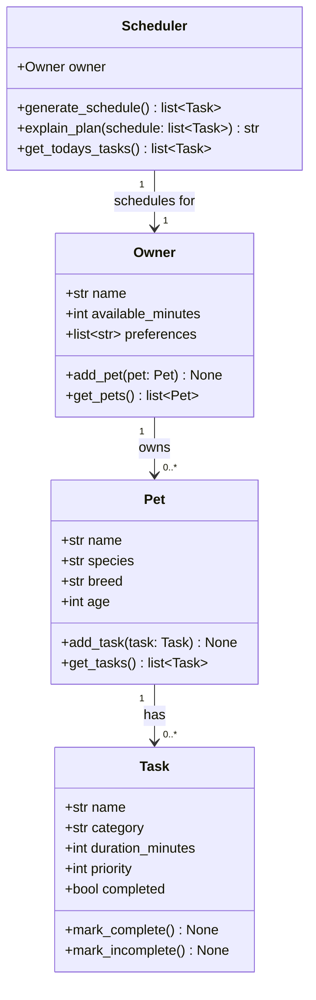

# PawPal+ Project Reflection

## 1. System Design

### Core User Actions

Three core actions a user should be able to perform:

1. **Add a pet** — Enter basic info about their pet (name, species, breed, age) so the app knows who it's caring for.
2. **Add and manage care tasks** — Create tasks (walks, feeding, meds, grooming, enrichment) with a duration and priority level.
3. **Generate and view today's daily plan** — Ask the scheduler to produce a prioritized daily schedule based on available time, task priorities, and constraints, and read an explanation of why that plan was chosen.

**a. Initial design**

The system uses four classes:

- **Owner** — Holds the pet owner's name and daily available time (in minutes). Acts as the entry point; owns a list of Pet objects.
- **Pet** — Stores pet details (name, species, breed, age) and holds the list of Tasks assigned to that pet.
- **Task** — A dataclass representing a single care task with a name, category, duration, priority (1–5), and completion status.
- **Scheduler** — Takes an Owner and generates a daily plan. It filters tasks by available time and sorts by priority, then provides a human-readable explanation of the plan.

**b. Design changes**

After reviewing the skeleton, one immediate improvement was making `_tasks` a private field on `Pet` (initialized via `dataclass field`) instead of a public list. This prevents callers from bypassing `add_task()` and mutating the list directly — enforcing a clean interface from the start.

A second consideration raised was whether `Scheduler` should hold tasks directly rather than pulling them from `Owner → Pet` at call time. The current design (pulling at call time via `get_todays_tasks()`) was kept because it keeps the Scheduler stateless, making it easier to re-run scheduling without stale data.

---

## 2. Scheduling Logic and Tradeoffs

**a. Constraints and priorities**

The scheduler considers two main constraints:

1. **Available time** (`owner.available_minutes`) — the hard upper bound. Tasks are included greedily until no more fit.
2. **Priority** (1=low, 2=medium, 3=high) — the tiebreaker. When not all tasks fit, highest-priority tasks are selected first.

Time was treated as the primary hard constraint because it's non-negotiable: you simply cannot do a 30-minute walk in zero minutes. Priority is the secondary, "soft" constraint that guides which tasks to sacrifice when time runs short.

**b. Tradeoffs**

The scheduler uses a **greedy, priority-first** algorithm: it sorts candidates by priority descending, then picks each task if it fits in the remaining time. This means a single large high-priority task can "crowd out" several smaller medium-priority tasks even though the smaller tasks might collectively be more valuable.

**Why it's reasonable:** For a pet owner, missing a high-priority task (like medication) is far worse than missing several low-priority ones (like extra enrichment). The greedy approach is also transparent and predictable — the owner can always see exactly why a task was dropped. A more sophisticated algorithm (e.g., 0/1 knapsack) would find the theoretically optimal set, but would be harder to explain and overkill for daily pet care schedules with at most a dozen tasks.

---

## 3. AI Collaboration

**a. How you used AI**

AI was used in three distinct ways:
- **Phase 1 (Design)** — brainstorming which classes to create and generating the initial Mermaid UML diagram from a natural-language description of the system.
- **Phase 2 (Skeleton → Implementation)** — translating UML stubs into working Python, especially figuring out how `Scheduler` should pull tasks from `Owner → Pet` without holding state.
- **Phase 4 (Algorithms)** — asking for lightweight conflict-detection strategies and how to use `lambda` keys with `sorted()` for the HH:MM time-of-day strings.

The most effective prompts were specific and scoped: "given this skeleton, how should the Scheduler retrieve tasks?" was far more useful than "write me a scheduler." Narrow questions produced usable code; broad ones produced over-engineered solutions.

**b. Judgment and verification**

When asked to generate test cases, the AI initially suggested mocking `date.today()` using `unittest.mock.patch`. The suggestion was not accepted as-is because the tests were simpler to read by just passing an explicit `due_date` into the `Task` constructor — the dataclass already supports it. The mock approach would have made the test setup fragile and harder for a reader to follow. This was verified by writing both versions and confirming the explicit-date version was shorter, clearer, and passed just as reliably.

---

## 4. Testing and Verification

**a. What you tested**

19 automated tests cover:
- **Basic class behaviour** — `mark_complete`, `mark_incomplete`, adding tasks/pets, case-insensitive pet lookup.
- **Sorting correctness** — `sort_by_time` returns chronological order; `sort_by_priority` returns descending priority.
- **Filtering** — `filter_by_status` and `filter_by_pet` return the right subsets.
- **Schedule generation** — respects the time limit, prefers high-priority tasks, returns empty for zero available minutes, and sorts the final output chronologically.
- **Recurring tasks** — daily recurrence creates a task due tomorrow; weekly creates one in 7 days; one-off produces no next occurrence.
- **Conflict detection** — single and multiple overlapping time slots are flagged; non-overlapping tasks produce no warnings.

These tests are important because the scheduler's correctness guarantees depend entirely on these behaviours: if `sort_by_priority` were wrong, high-priority meds could be dropped while low-priority grooming was kept.

**b. Confidence**

★★★★☆ (4/5). The happy path and most edge cases are covered. Cases not yet tested:
- An owner with no pets (empty schedule expected).
- Tasks whose `duration_minutes` equals exactly `available_minutes` (boundary condition).
- Very large task lists (performance).
- Recurring tasks whose `due_date` is not today (future scheduling window).

---

## 5. Reflection

**a. What went well**

The "CLI-first" workflow (building and verifying `main.py` before touching Streamlit) paid off. Because all logic lived in `pawpal_system.py` and was verified through `python -m pytest`, wiring `app.py` was straightforward — the UI just calls existing methods rather than containing any scheduling logic itself.

**b. What you would improve**

The conflict detection only flags tasks at the *exact same* `time_of_day` string. A more useful version would detect *overlapping durations* (e.g., a 30-minute walk starting at 07:00 overlaps with a task starting at 07:15). That requires tracking start + end times rather than a single string field.

**c. Key takeaway**

Designing the UML first meant every AI-generated code suggestion had a clear target shape to aim at. Without the diagram, the AI tended to invent structure (extra classes, inheritance, etc.) that looked plausible but didn't match the actual requirements. Being the "lead architect" means giving AI a precise blueprint, not just a vague description — the more specific the prompt, the less judgment the AI needs to exercise on your behalf.
